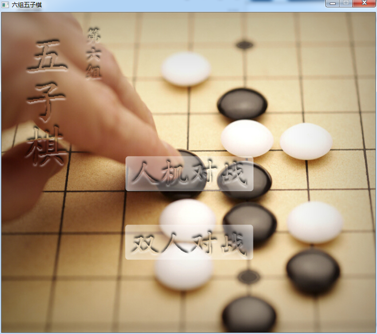
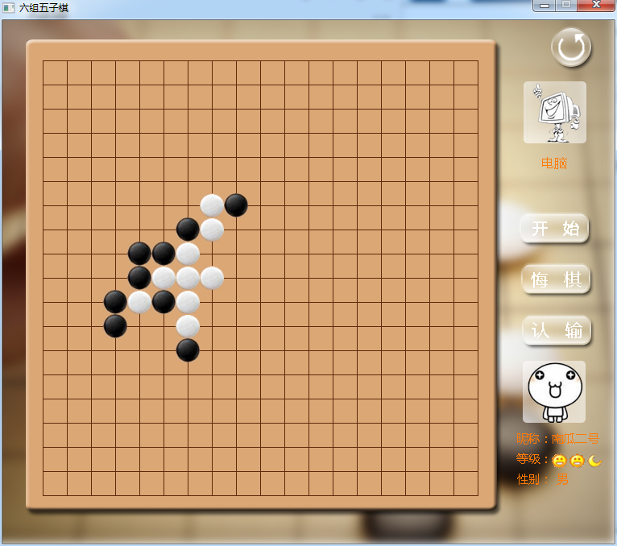
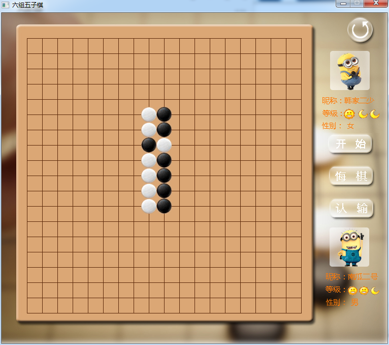

## 名称:
- 五子棋

## 软件简介
- 采用三种编程语言分别实现了不同的版本。
- C语言版本实现了五子棋算法和人机对战功能，使用了easyx图形界面库绘制图像，按钮的点击采用的是坐标检测的原理，没有采用按钮控件的事件和回调机制。
- VB.NET版本实现了局域网网络对战功能，网络使用的是UDP实现。
- Python版本计划实现网络对战版本，使用TCP实现，图形界面采用PyQt实现。网络对战计划采用中转服务器的形式，或者采用TCP打洞来实现p2p模式的编程。

## 说明:
- 开发平台: Windows 7 X64.
- 开发环境: VS2010 & pycharm

## 用法:
- 编译运行后，直接按照普通五子棋游戏的模式运行。

## 开源协议:
- 雪碧软件协议

## 项目截图
- 主界面

- 人机对战

- 双人对战

